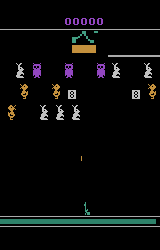

# TorchBeastPopArt
PopArt extension to TorchBeast, the PyTorch implementation of IMPALA.

# Experiments

## Movies

Single-task:  


  
Multi-task (clipped):  




  
Multi-task PopArt:  


Saliency:  


## Trained models

| Name | Environments | Steps (millions) |
| ---- |------------- | ---------------- |
| AirRaid | AirRaidNoFrameskip-v4 | 50 |
| Carnival | CarnivalNoFrameskip-v4  | 50 |
| DemonAttack | DemonAttackNoFrameskip-v4 | 50 |
| NameThisGame| ameThisGameNoFrameskip-v4 | 50 |
| Pong| PongNoFrameskip-v4 | 50 |
| SpaceInvaders | SpaceInvadersNoFrameskip-v4 | 50 |
| MultiTask | AirRaid,Carnival,DemonAttack,NameThisGame,Pong,SpaceInvaders NoFrameskip-v4 | 300 |
| MultiTask3Games | Carnival,DemonAttack,AirRaid NoFrameskip-v4 | 100 |
| MultiTaskPopArt | AirRaid,Carnival,DemonAttack,NameThisGame,Pong,SpaceInvaders NoFrameskip-v4 | 300 |


# Running the code
# Training a model
```bash
python -m torchbeast.polybeast --mode train --xpid MultiTaskPopArt --env AirRaidNoFrameskip-v4,CarnivalNoFrameskip-v4,DemonAttackNoFrameskip-v4,NameThisGameNoFrameskip-v4,PongNoFrameskip-v4,SpaceInvadersNoFrameskip-v4 --total_steps 50000000 --use_popart
```
There are th efollowing additional flags, as compared to the original TorchBeast implementation:
- use_popart, to enable to PopArt extension
- save_model_every_nsteps, to save intermediate models during training

# Testing a model
```bash
python -m torchbeast.polybeast --mode test --xpid MultiTaskPopArt --env PongNoFrameskip-v4 --savedir=./models
python -m torchbeast.polybeast --mode test_render --xpid MultiTaskPopArt --env PongNoFrameskip-v4 --savedir=./models
```

# Saliency
```bash
python -m torchbeast.saliency --xpid MultiTask --env PongNoFrameskip-v4 --first_frame 0 --num_frames 100 --savedir=./models
```
Note that compared to the original Saliency code, the extension does not produce a movie directly, but saves the frames as individual images. Animated gifs can subsequently produced with a simple Jupyter notebook.


## References
TorchBeast
```
@article{torchbeast2019,
  title={{TorchBeast: A PyTorch Platform for Distributed RL}},
  author={Heinrich K\"{u}ttler and Nantas Nardelli and Thibaut Lavril and Marco Selvatici and Viswanath Sivakumar and Tim Rockt\"{a}schel and Edward Grefenstette},
  year={2019},
  journal={arXiv preprint arXiv:1910.03552},
  url={https://github.com/facebookresearch/torchbeast},
}
```

PopArt
```
@inproceedings{hessel2019,
  title={Multi-task deep reinforcement learning with popart},
  author={Hessel, Matteo and Soyer, Hubert and Espeholt, Lasse and Czarnecki, Wojciech and Schmitt, Simon and van Hasselt, Hado},
  booktitle={Proceedings of the AAAI Conference on Artificial Intelligence},
  volume={33},
  pages={3796--3803},
  year={2019}
}
```

Saliency
```
@article{greydanus2017visualizing,
  title={Visualizing and Understanding Atari Agents},
  author={Greydanus, Sam and Koul, Anurag and Dodge, Jonathan and Fern, Alan},
  journal={arXiv preprint arXiv:1711.00138},
  year={2017},
  url={https://github.com/greydanus/visualize_atari},
}
```
